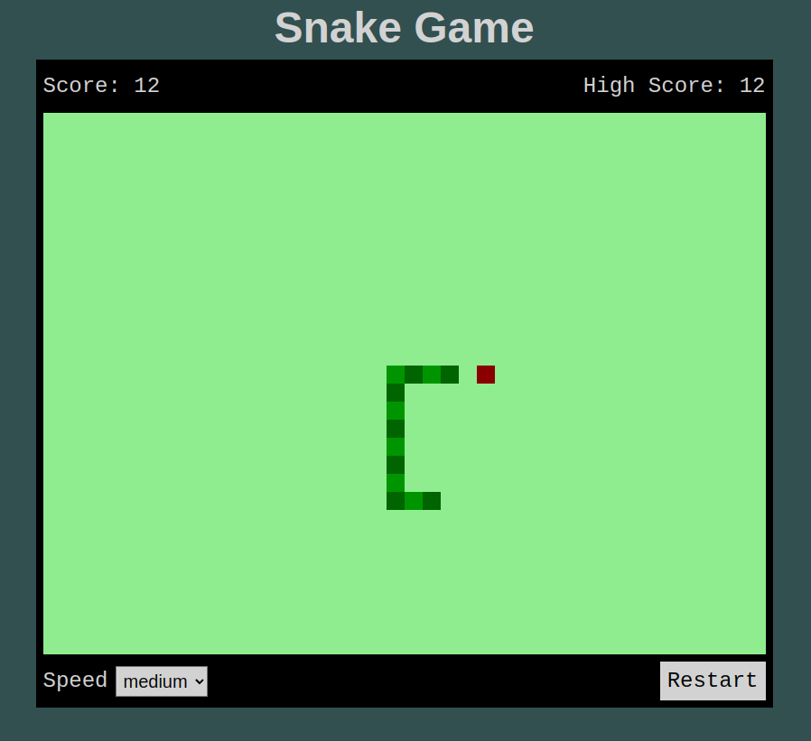

# Snake Game

_Play the classic game of Snake right in your browser!_

**Play the game [here](https://et-codes.github.io/js-snake)!**

Move the snake with your arrow keys. Use the speed selector to set the difficulty of the game.

Each time your snake eats an "apple", it grows! Be careful not to run into the edge of the screen or into your own body, or the game will be over. The game keeps track of your highest score in local storage, so it persists between browser sessions.

This game was written with vanilla HTML, CSS, and JavaScript.

**Author:** Eric Thornton | [LinkedIn](https://www.linkedin.com/in/ethornton/)
